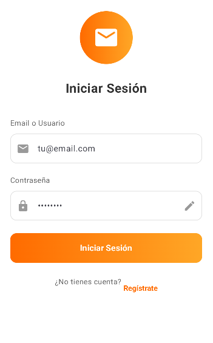
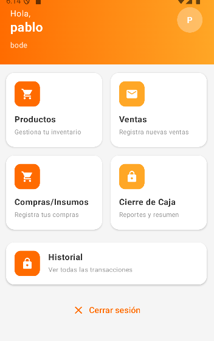
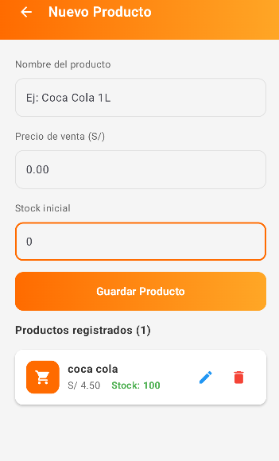
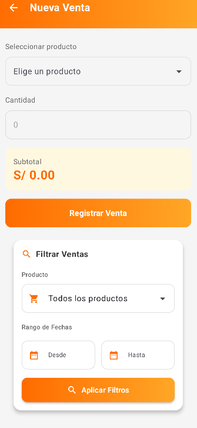
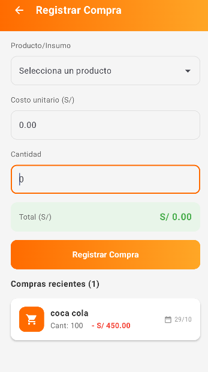
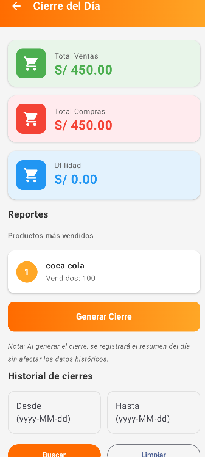
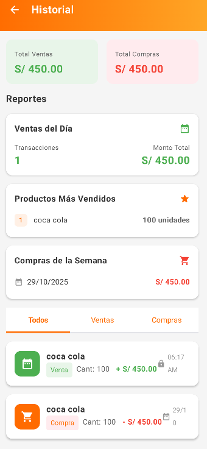

# BodeApp - Sistema de Gestión para Bodegas

## Descripción

BodeApp es una aplicación móvil Android desarrollada en Kotlin con Jetpack Compose que permite gestionar de manera eficiente las operaciones diarias de una bodega o tienda pequeña. La aplicación proporciona un sistema completo para el control de inventario, registro de ventas y compras, y generación de reportes de cierre de caja.

La aplicación utiliza arquitectura MVVM (Model-View-ViewModel) con Room Database para persistencia local de datos, garantizando un funcionamiento offline y una experiencia de usuario fluida.

## Equipo de Desarrollo

| Nombre | Rol |
|--------|-----|
| **Ramos Iman, Anderson** | Desarrollador Full Stack  |
| **Roman Mauricio, Jair** | Desarrollador Full Stack  |

## Diseño

Prototipo en Figma: [https://magma-tested-43542949.figma.site](https://magma-tested-43542949.figma.site)

## 📱 Capturas de Pantalla

  
  
  

  
  
  
  

## ⚙️ Funcionalidades

### Autenticación
- **Registro de usuarios**: Creación de cuenta con datos de la tienda
- **Inicio de sesión**: Sistema de autenticación seguro con validación de credenciales
- **Gestión de sesión**: Mantenimiento de sesión de usuario activo

### Gestión de Productos
- **Agregar productos**: Registro de nuevos productos con nombre, precio y stock inicial
- **Editar productos**: Modificación de información de productos existentes
- **Eliminar productos**: Eliminación de productos del inventario
- **Visualización de inventario**: Lista completa de productos con información de stock y precios
- **Control de stock**: Actualización automática del inventario según ventas y compras

### Gestión de Ventas
- **Registrar ventas**: Selección de productos y cantidad para registrar transacciones de venta
- **Cálculo automático**: Cálculo del total de venta basado en precio unitario y cantidad
- **Actualización de stock**: Reducción automática del inventario al realizar ventas
- **Historial de ventas**: Registro completo de todas las transacciones de venta

### Gestión de Compras
- **Registrar compras**: Registro de compras de productos para reabastecimiento
- **Incremento de stock**: Actualización automática del inventario al registrar compras
- **Historial de compras**: Registro completo de todas las transacciones de compra
- **Control de costos**: Seguimiento de inversiones en inventario

### Cierre de Caja
- **Resumen diario**: Visualización de todas las transacciones del día
- **Cálculo de totales**: Total de ventas e ingresos del período
- **Total de compras**: Suma de todas las compras realizadas
- **Balance final**: Cálculo automático del balance (ventas - compras)
- **Registro de cierre**: Guardado de información de cierre de caja con fecha y hora

### Historial y Reportes
- **Historial de transacciones**: Visualización de todas las ventas y compras realizadas
- **Filtrado por fecha**: Consulta de transacciones por períodos específicos
- **Detalles de transacciones**: Información completa de cada operación registrada
